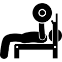

# WorkOut Tracker  

## Table of Content

- [Description](#description)
- [User Story](#user-story)
- [Development](#development)
- [Installation](#installation)
- [Dependencies](#dependencies)
- [Tests](#tests)
- [Built With](#built-with)
- [Questions](#questions)
- [Demo](#demo)
- [License](#license)
- [Acknowledgments](#acknowledgments)
- [CopyRight](#copyright)

## Description

An elegante frontend page to track your workouts, as everyone knows, it is proven to assist in reaching your goals, when you track your excercises and how you are progressing.
The stats page will allow you to see in elegante graphs your performance overtime, allowing you see where you can improve as well what excercises have had a positive impact in your workouts.

## User Story

As a user, I want to be able to view create and track daily workouts.  
I want to be able to log multiple exercises in a workout on a given day.  
I should also be able to track the name, type, weight, sets, reps, and duration of exercise.  
If the exercise is a cardio exercise, I should be able to track my distance traveled.

## Development

Since I was givent the frontend, I worked on 5 files; The server.js, models/index.js, models/workout.js, routes/apiRoutes.js & routes/htmlRoutes.js. Once I created the server.js and tested I was able to connect to the server on port 9000, I proceeded working on the routes. As soon I was able to reach these pages on the localhost, I continued working on the models files to allow the DB to be created and to be ready to store data.  
As soon the local environment was working and there no further errors, I pushed to heroku and ensured, I was able to use it and it was fully functional.

## Installation

To use this application:

Clone this repo into your local and run 'npm i' in the root file of the folder. This will install all neccesary dependancies and then type 'npm start' in terminal to begin hosting locally. navigate to your browser if not already open and put this url 'http://localhost:9000/' into the url address bar to find yourself on the workout tracker app. Follow app instructions to create new workouts, add exercises to existing workouts and view all your workouts and activity.

### Dependencies

Bootstrap, HTML, CSS, JS, NodeJS, express, mongoose, mongoDB, chai, dotenv, nodemon, mocha and morgan.

## Tests

Canary test set as I am looking at including more as soon as I learn how to create them!

### Built With

- [VScode](https://code.visualstudio.com/) - The editor of choice
- [Notepad++](https://notepad-plus-plus.org/) - My second editor
- [Gitbash](https://gitforwindows.org/) - What would we do without our bash?
- [Heroku](https://heroku.com) - Perfect to upload dev work for testing out

### Questions

1. How can I run the application?  
You just need to follow the instructions on the [installation](#installation) section, where it is explained

2. What if I get an error?  
Ensure that you have install all the dependencies required for this to work. See [Dependencies](#dependencies) section

3. Can I refractor the code in the any of the files file?  
Yes, you can modify and refractor the code

## Demo

## License

[MIT License](./LICENSE)

### Authors

- **John Merchan**

## Acknowledgments

Thanks to Agustin and to both TA's for sharting their knowledge. Also to my peers who engage in questions and also sharing knowlegde as well as some laughs. Needless to say to my sons, my soul-my life.

***

### CopyRight

Copyright 2020 &copy; John Merchan

:australia:

[Table of Content](#Table-of-Content) --- [Back to Top](#Employee-Tracker) --- [Installation](#Installation)